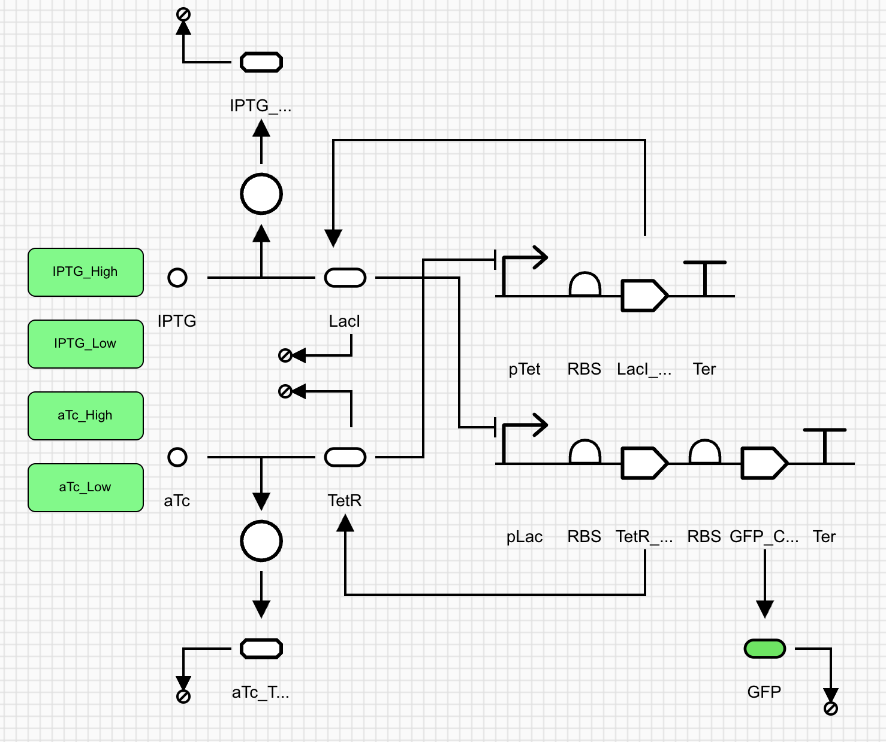
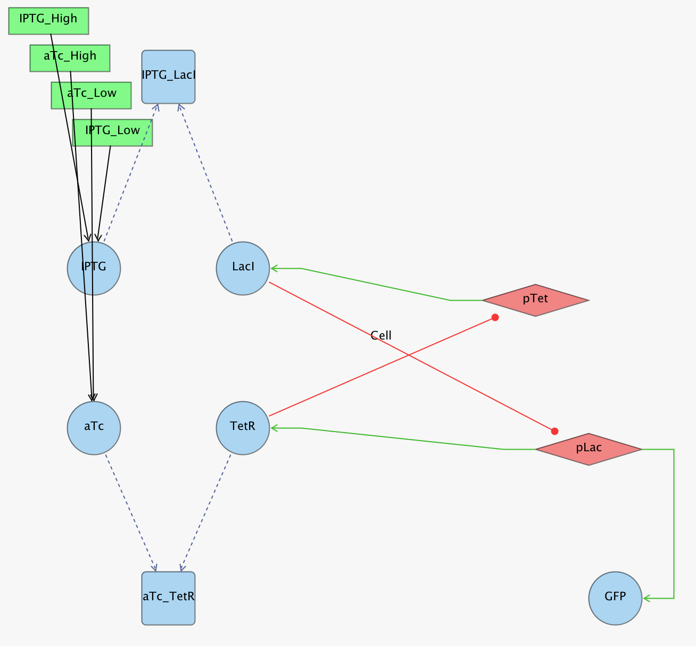
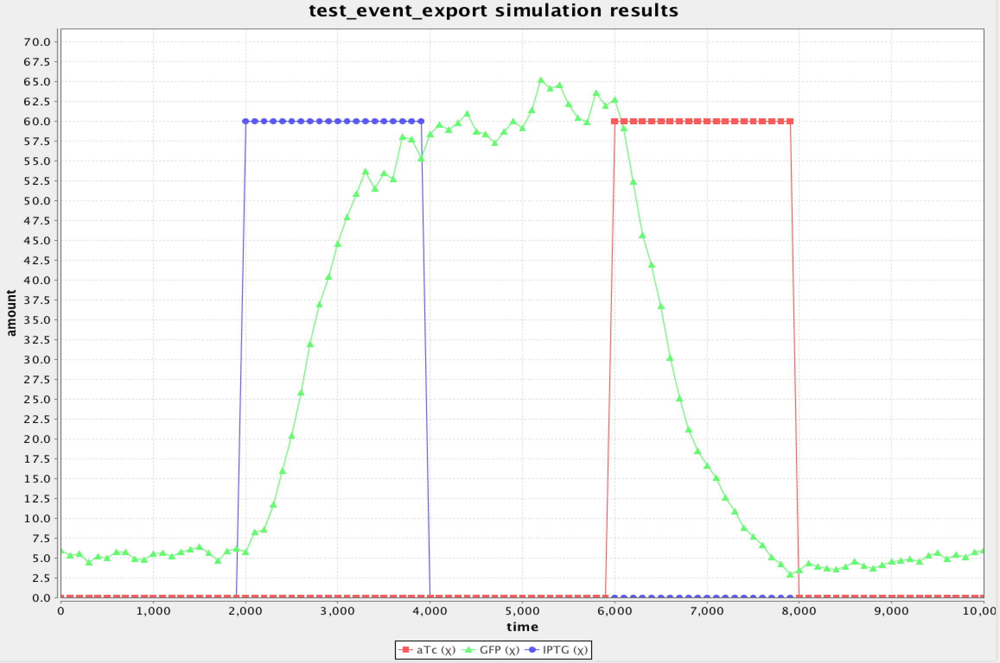

# SBML Export Feature for SBOLCanvas

> **Project Snapshot (CU Boulder Fall 2025)**
>
> This branch (`fa25-sbml-export`) is a snapshot of the work completed for the Fall 2025 Genetic Circuits class project. Work continued in the main repo.
>
> - For the current version, see the main repository:  
>   https://github.com/SynBioDex/SBOLCanvas/

This branch implements MXGraph-to-SBML export support using JSBML, allowing SBOLCanvas to act as a front-end design tool for simulators like iBioSim.

## Key Features

- **SBML Export**: Generates SBML species and reactions.
- **TU-Based Mapping**: Coverts visual backbones into transcriptional units.
- **Kinetic Laws**: Generates Hill equations for regulation (repression/activation), mass-action for complexes and degradation.
- **Event System**: Time-based events to toggle simulation parameters (e.g., adding IPTG).
- **Visual Layout**: Exports the visual layout of the design using the SBML Layout Extension.

## Implementation Phases

1.  **Species Creation**: Map molecular species (proteins, small molecules) and create a Promoter Species for each backbone to represent TUs.
2.  **Reaction Creation**: Generate reactions based on interaction edges.
    - _Genetic Production_: TU reactions with Hill function.
    - _Complex Formation_: Reversible mass-action.
    - _Degradation_: Irreversible mass-action.
3.  **Visual Layout**: Use SBML Layout Extension to match the design in the simulation tool.
4.  **Events**: Handle Events for simulation parameters.

## How to Run

#### Backend

```bash
cd SBOLCanvasBackend
npm install -g nodemon
npx nodemon
```

#### Frontend

```bash
cd SBOLCanvasFrontend
npm install
npm run prebuild # Only needed for the first run
ng serve -c development
```

## How to Test SBML Export

#### Example Files

- `example_files/sbolcanvas_sbol-toggle.xml`: SBOL design file for the toggle switch.
- `example_files/sbolcanvas_sbml-export.xml`: SBML file already exported from SBOLCanvas (using the steps below).
- `example_files/ibiosim_sbml-toggle-export.xml`: SBML file created in iBioSim for comparison.

#### Testing Steps

1.  **Load the Design**: Open SBOLCanvas and load `example_files/sbolcanvas_sbol-toggle.xml`.
2.  **Configure Simulation**:
    - Add **Events** to the canvas (High and Low Events for IPTG and aTc).
    - Mark `IPTG` and `aTc` as **Boundary Conditions** in their glyph info.
3.  **Export**: Select **File -> Export File -> Format: SBML**.
4.  **Simulate**: Load the SBML file into iBioSim and run the simulation.

## Results

#### SBOLCanvas Design



#### iBioSim Import



#### iBioSim Simulation



## Future Work

- **SBOL Param Storage**: Storing simulation parameters and events in SBOL files (currently memory-only).
- **SBML Import**: Converting SBML back to SBOLCanvas.
- **Unregulated Promoters**: Support for unregulated promoters.
- **Mixed Regulation**: Support for promoters with both activation and repression.
- **Events Visual Layout**: Include event glyphs in the SBML Layout.
- **Event System Parity**: Match all Event features of iBioSim (multiple assignments, custom triggers, priority, etc).
- **User Validation**: Give user feedback on design issues before export.

## Modified Files

| Files Modified for SBML Export Feature                              |
| :------------------------------------------------------------------ |
| `SBOLCanvasBackend/src/data/GlyphInfo.java`                         |
| `SBOLCanvasBackend/src/data/InteractionInfo.java`                   |
| `SBOLCanvasBackend/src/servlets/Convert.java`                       |
| `SBOLCanvasBackend/src/servlets/Export.java`                        |
| `SBOLCanvasBackend/src/data/EventInfo.java`                         |
| `SBOLCanvasBackend/src/utils/Converter.java`                        |
| `SBOLCanvasBackend/src/utils/MxToSBML.java`                         |
| `SBOLCanvasBackend/src/utils/MxToSBOL.java`                         |
| `SBOLCanvasBackend/src/utils/SBOLData.java`                         |
| `SBOLCanvasFrontend/src/app/app.module.ts`                          |
| `SBOLCanvasFrontend/src/app/canvas/canvas.component.ts`             |
| `SBOLCanvasFrontend/src/app/eventInfo.ts`                           |
| `SBOLCanvasFrontend/src/app/glyph-menu/glyph-menu.component.html`   |
| `SBOLCanvasFrontend/src/app/glyph-menu/glyph-menu.component.ts`     |
| `SBOLCanvasFrontend/src/app/glyphInfo.ts`                           |
| `SBOLCanvasFrontend/src/app/graph-base.ts`                          |
| `SBOLCanvasFrontend/src/app/graph-helpers.ts`                       |
| `SBOLCanvasFrontend/src/app/graph.service.ts`                       |
| `SBOLCanvasFrontend/src/app/info-editor/info-editor.component.css`  |
| `SBOLCanvasFrontend/src/app/info-editor/info-editor.component.html` |
| `SBOLCanvasFrontend/src/app/info-editor/info-editor.component.ts`   |
| `SBOLCanvasFrontend/src/app/interactionInfo.ts`                     |
| `SBOLCanvasFrontend/src/app/metadata.service.ts`                    |
| `SBOLCanvasFrontend/src/assets/glyph_stencils/utils/.bundle_order`  |
| `SBOLCanvasFrontend/src/assets/glyph_stencils/utils/event.xml`      |
| `example_files/ibiosim_sbml-toggle-export.xml`                      |
| `example_files/sbolcanvas_sbml-export.xml`                          |
| `example_files/sbolcanvas_sbol-toggle.xml`                          |

---

## AI Usage Disclosure

Google Gemini was used to summarize api documentation, codebase research, and implementation planning notes, into the [SMBL_Export_Design.md](ref/SBML_Export_Design.md) document, which was used as reference for AI-assistance during development.
